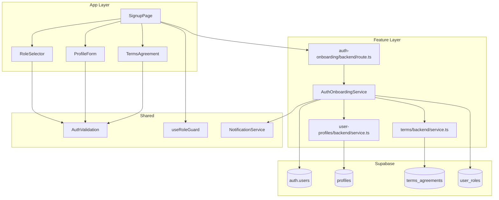

# UC-001: 역할 선택 & 온보딩 - 구현 계획

## 개요

### Feature Modules
- **Auth Onboarding Feature** (`src/features/auth-onboarding/`)
  - Supabase Auth 회원가입, 역할 선택, 초기 세션 생성까지 담당하는 유스케이스 중심 모듈
  - `backend`(route/service/schema/error)와 `components`(폼, 역할 선택, 단계 UI), `hooks`(상태 관리)로 구성
- **User Profiles Feature** (`src/features/user-profiles/`)
  - `profiles` 테이블 CRUD 및 역할 메타데이터 유지를 위한 서비스 계층
  - 가입 직후 프로필 저장, 이후 조회 시 재사용 가능한 API 제공
- **Terms Feature** (`src/features/terms/`)
  - 최신 약관 버전 조회 및 `terms_agreements` 기록 저장을 담당하는 백엔드/프론트 공유 모듈

### Shared Modules
- **Auth Validation Schemas** (`src/lib/validation/auth.ts`)
  - zod 기반 회원가입 입력값 검증 스키마 및 에러 메시지 집합
- **useRoleGuard Hook** (`src/hooks/useRoleGuard.ts`)
  - 클라이언트 라우팅 시 현재 사용자 역할을 검사하고 적절한 리다이렉션 수행
- **Notification Service** (`src/lib/notifications/toast.ts`)
  - 가입 성공/실패, 재시도 안내 등 공통 알림 출력을 담당

## Diagram

## Implementation Plan

### 1. Database Schema
**파일**: `supabase/migrations/0003_create_onboarding_tables.sql`
- `user_role` enum(`learner`, `instructor`) 생성 후 `profiles.role` 컬럼에서 참조
- `profiles` 테이블 작성: PK=auth 사용자 id, 이름/휴대폰/역할/타임스탬프 컬럼 포함, `phone` 형식 검증을 위한 CHECK 제약 추가
- `terms_agreements` 테이블 작성: `user_id`, `terms_version`, `agreed_at` 저장 및 `(user_id, terms_version)` 유니크 인덱스 생성
- 기본 약관 버전 시드용 INSERT 구문 포함 (필요 시)

### 2. Backend Implementation

#### Auth Onboarding Schema
**파일**: `src/features/auth-onboarding/backend/schema.ts`
- `SignupRequestSchema`: 이메일/비밀번호/역할/이름/휴대폰/약관 동의 여부
- `SignupResponseSchema`: 사용자 요약, 세션 토큰, `redirectTo`

#### Auth Onboarding Service
**파일**: `src/features/auth-onboarding/backend/service.ts`
- Supabase 시스템 역할 클라이언트 주입, 입력 검증 후 순차 작업 처리
- 이미 존재하는 이메일 체크 → Auth 사용자 생성 → `profiles` 인서트 → `terms_agreements` 저장 순
- 오류 발생 시 `failure(status, code, message, details)` 사용해 일관된 응답 반환

**Unit Tests** (`src/features/auth-onboarding/backend/__tests__/service.test.ts`):
- `creates auth user, profile, and agreement when payload valid`
- `rejects duplicate email with EMAIL_ALREADY_USED code`
- `enforces password policy failure`
- `rolls back profile insert when agreement write fails`

#### User Profiles Service
**파일**: `src/features/user-profiles/backend/service.ts`
- `createProfile`/`getProfileByUserId`/`updateProfile` 함수 분리, 트랜잭션 유사 동작 위해 Supabase RPC 사용 고려

**Unit Tests**:
- `persists profile with valid payload`
- `rejects phone number when format invalid`
- `updates timestamps on profile change`

#### Terms Service
**파일**: `src/features/terms/backend/service.ts`
- 최신 약관 버전 조회 캐시, 동의 기록 저장 및 동의 여부 확인 유틸 제공

**Unit Tests**:
- `returns latest published terms`
- `stores agreement only once per version`
- `handles database failure with TERMS_WRITE_FAILED`

#### Signup Route Registrar
**파일**: `src/features/auth-onboarding/backend/route.ts`
- `registerAuthOnboardingRoutes(app: Hono<AppEnv>)` 내 `/auth/signup` POST 정의
- 미들웨어 체인: `withAppContext` → `withSupabase` → 본 라우터
- 성공 시 `respond(c, success(SignupResponseSchema.parse(...)))`

### 3. Frontend Implementation

#### Signup Page
**파일**: `src/app/signup/page.tsx`
- 서버 컴포넌트에서 공통 레이아웃 제공, 클라이언트 `SignupForm` 컴포넌트 주입

**QA Sheet**:
- [ ] 입력 필수값 누락 시 필드별 에러 메시지가 노출되는가?
- [ ] 비밀번호 정책을 충족하지 못하면 즉시 경고가 표시되는가?
- [ ] 역할 선택에 따라 요약 설명이 변경되는가?
- [ ] 약관 비동의 시 제출 버튼이 비활성화되는가?
- [ ] 가입 성공 시 역할별 리다이렉션이 정확한가? (Learner → `/courses`, Instructor → `/dashboard`)
- [ ] 네트워크 오류 발생 시 재시도 액션이 노출되는가?

#### Auth Onboarding Components
**위치**: `src/features/auth-onboarding/components/`
- `SignupForm.tsx`, `RoleSelector.tsx`, `ProfileFields.tsx`, `TermsCheckbox.tsx`

**QA Sheet**:
- [ ] RoleSelector가 두 역할을 모두 표시하고 키보드 접근성이 보장되는가?
- [ ] ProfileFields가 휴대폰 입력 마스크와 유효성 검사를 지원하는가?
- [ ] TermsCheckbox가 최신 약관 링크를 제공하는가?
- [ ] 단계별 진행 상태가 시각적으로 표시되는가?

#### Signup Hook
**파일**: `src/features/auth-onboarding/hooks/useSignupForm.ts`
- React Hook Form + zodResolver 조합, `mutation`으로 API 호출, 낙관적 상태 관리

### 4. Shared Utilities
- `src/lib/validation/auth.ts`: `SignupSchema`, `PasswordPolicy`, `RoleEnum` 등 내보내기
- `src/hooks/useRoleGuard.ts`: SSR + CSR 라우트 보호, 미인증 시 `/login`으로 이동, 역할 불일치 시 해당 초기 페이지로 이동
- `src/lib/notifications/toast.ts`: 성공/실패 메시지를 통일된 토스트 API로 감싸기

### 5. Integration & Observability
- `src/backend/hono/app.ts`에서 `registerAuthOnboardingRoutes` 호출 추가
- `src/lib/supabase/server.ts`에 신규 테이블 타입 정의 (`Database` 타입 확장)
- 가입 성공 시 `analytics.track('signup_completed', { role })` 추가 (존재 시)
- Supabase Auth 이메일 템플릿/비밀번호 정책 문서화 (`README` TODO)

### 6. Testing Strategy
- **Unit**: 서비스/유틸 단위 테스트 (Vitest + Supabase client mock)
- **Integration**: `/api/auth/signup` 경로에 대한 요청/응답 시나리오 테스트 (`tests/api/auth/signup.test.ts`)
- **QA**: Cypress 또는 Playwright 시나리오 추가 (`tests/e2e/signup.spec.ts`) – 역할별 리다이렉션 포함
- **Manual**: 실제 Supabase 프로젝트로 연동되는 샌드박스에서 이메일 중복/약관 미동의/네트워크 오류 케이스 점검
