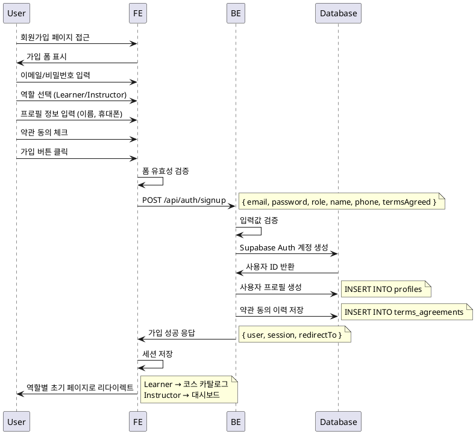

# UC-001: 역할 선택 & 온보딩

## Primary Actor
- 신규 사용자 (미가입자)

## Precondition
- 사용자가 서비스에 처음 접근
- 유효한 이메일 주소와 비밀번호를 보유

## Trigger
- 사용자가 회원가입 페이지에 접근하여 가입 프로세스를 시작

## Main Scenario

1. 사용자가 회원가입 페이지에서 이메일/비밀번호 입력
2. 사용자가 역할 선택 (Learner 또는 Instructor)
3. 사용자가 공통 프로필 정보 입력 (이름, 휴대폰번호)
4. 사용자가 약관에 동의
5. 시스템이 Auth 계정 생성 (Supabase Auth)
6. 시스템이 사용자 역할 저장
7. 시스템이 프로필 레코드 생성
8. 시스템이 약관 동의 이력 저장
9. 시스템이 기본 권한 토큰 발급
10. 역할에 따라 초기 페이지로 리다이렉트
    - Learner: 코스 카탈로그 페이지
    - Instructor: 대시보드 페이지

## Edge Cases

- **이메일 중복**: 이미 가입된 이메일로 시도 시 오류 메시지 표시
- **비밀번호 정책 위반**: 약한 비밀번호 입력 시 정책 안내 및 재입력 요구
- **필수 정보 누락**: 이름, 휴대폰번호 미입력 시 폼 검증 오류
- **약관 미동의**: 약관 동의하지 않을 시 가입 진행 불가
- **네트워크 오류**: 가입 중 연결 실패 시 재시도 안내
- **서버 오류**: Supabase 연결 실패 시 시스템 오류 메시지

## Business Rules

- 이메일은 유일해야 함
- 비밀번호는 최소 8자 이상, 영문/숫자/특수문자 포함
- 이름은 2-20자 한글/영문만 허용
- 휴대폰번호는 010-XXXX-XXXX 형식
- 약관 동의는 필수
- 역할은 가입 후 변경 불가
- 가입 완료 후 즉시 로그인 상태로 전환

## Sequence Diagram

