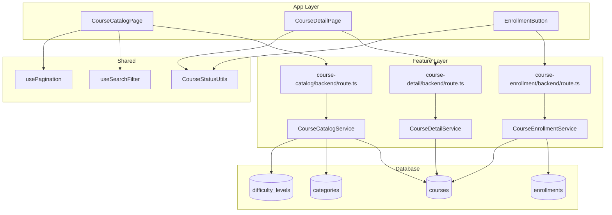

# UC-002: 코스 탐색 & 수강신청/취소 - 구현 계획

## 개요

### Feature Modules
- **Course Catalog Feature** (`src/features/course-catalog/`)
  - 게시된 코스 목록/상세 조회, 검색∙필터∙정렬을 처리하는 핵심 기능
  - `backend`(route/service/schema)와 `components`(카드, 필터, 리스트), `hooks`(데이터 패칭)로 분리
- **Course Enrollment Feature** (`src/features/course-enrollment/`)
  - 수강신청/취소 API, 대시보드 반영 로직, 정원 검사를 담당
- **Course Detail Feature** (`src/features/course-detail/`)
  - 코스 상세 페이지 콘텐츠 구성, 강사/커리큘럼 요약 및 수강 상태 표시

### Shared Modules
- **Search & Filter Hook** (`src/hooks/useSearchFilter.ts`)
  - 검색어, 필터, 정렬, 페이지네이션 상태를 중앙에서 관리
- **Pagination Hook** (`src/hooks/usePagination.ts`)
  - 무한스크롤/페이지 단위 전환 로직과 metadata 통합
- **Course Status Utils** (`src/lib/course-status.ts`)
  - 코스 상태에 따른 UI, 신청 가능 여부 계산, 배지 스타일 제공

## Diagram

## Implementation Plan

### 1. Database Schema
**파일**: `supabase/migrations/0004_create_course_catalog.sql`
- `categories` (`id`, `name`, `description`, `active`, 타임스탬프)
- `difficulty_levels` (`id`, `name`, `level`, `description`, `active`)
- `courses` 테이블: `instructor_id`, `title`, `summary`, `thumbnail_url`, `category_id`, `difficulty_id`, `status`, `max_students`, `enrolled_count`, `published_at`
- `enrollments` 테이블: `course_id`, `learner_id`, `enrolled_at`, `cancelled_at`
- 인덱스: `courses_status_idx`, `courses_category_idx`, `courses_published_at_idx`, `enrollments_learner_idx`
- `enrolled_count` 는 DB 트리거나 materialized view 대신 서비스에서 증감 (단순 카운트)

### 2. Backend Implementation

#### Course Catalog Schema
**파일**: `src/features/course-catalog/backend/schema.ts`
- `CourseFiltersSchema`: `search`, `category`, `difficulty`, `sort`, `page`, `limit`
- `CourseSummarySchema`: 카드 표시용 필드 (제목, 강사명, 진행 방식, 현재 수강생 수 등)
- `CourseDetailSchema`: 상세 페이지용 필드 (커리큘럼, 목표, 요구사항 등)

#### Course Catalog Service
**파일**: `src/features/course-catalog/backend/service.ts`
- 필터 조건 조합, 공개 상태(`published`)만 조회, instructor join
- `getCourses(filters, viewerId)`/`getCourseById(courseId, viewerId)` 제공

**Unit Tests** (`src/features/course-catalog/backend/__tests__/service.test.ts`):
- `returns published courses sorted by latest`
- `filters by category and difficulty`
- `hides draft/archived courses`
- `marks enrollmentStatus based on existing enrollments`

#### Course Detail Service
**파일**: `src/features/course-detail/backend/service.ts`
- 요약, 커리큘럼, 강사 프로필, 유사 코스 등사; viewer가 강사일 경우 관리 액션 포함

**Unit Tests**:
- `returns course detail when published`
- `returns instructor_view metadata when viewer owns course`
- `throws COURSE_NOT_FOUND for missing id`

#### Course Enrollment Service
**파일**: `src/features/course-enrollment/backend/service.ts`
- `enroll(learnerId, courseId)` → 중복 검사, 정원 검사, `enrollments` 인서트, `courses.enrolled_count` 증가
- `cancel(learnerId, courseId)` → 기존 레코드 soft delete (`cancelled_at` 설정)
- Learner 대시보드/알림 연동을 위해 이벤트 payload 반환

**Unit Tests** (`__tests__/service.test.ts`):
- `creates enrollment when learner not enrolled`
- `rejects duplicate enrollment`
- `rejects enrollment when course archived`
- `rejects when max_students reached`
- `cancels enrollment and marks timestamp`

#### Route Registrars
- `src/features/course-catalog/backend/route.ts`: `GET /api/courses`, `GET /api/courses/:id`, `GET /api/categories`, `GET /api/difficulty-levels`
- `src/features/course-enrollment/backend/route.ts`: `POST /api/enrollments`, `DELETE /api/enrollments/:id`, `GET /api/enrollments/me`
- 각각 `respond`/`failure` 활용, 쿼리 파라미터는 `CourseFiltersSchema`로 검증

### 3. Frontend Implementation

#### Course Catalog Page
**파일**: `src/app/courses/page.tsx`
- 서버 컴포넌트에서 필터 기본값 주입, 클라이언트 컴포넌트가 데이터 패칭

**QA Sheet**:
- [ ] 초기 진입 시 게시된 코스만 표시되는가?
- [ ] 검색어 입력 시 리스트가 300ms 디바운스로 업데이트되는가?
- [ ] 필터 선택 상태가 URL 쿼리와 동기화되는가?
- [ ] 정렬 옵션 변경 시 카드 순서가 변경되는가?
- [ ] 페이지네이션(또는 무한스크롤)이 정상 동작하는가?
- [ ] 네트워크 오류 시 재시도 버튼이 표시되는가?

#### Course Detail Page
**파일**: `src/app/courses/[courseId]/page.tsx`
- 코스 메타, 커리큘럼, 강사 프로필, 수강 버튼 표시; CSR로 Enrollment mutation 수행

**QA Sheet**:
- [ ] 코스가 존재하지 않을 때 404 페이지로 이동하는가?
- [ ] 강사/카테고리/난이도/요구사항이 정확히 표시되는가?
- [ ] 이미 수강 중이면 "수강취소" 버튼이 노출되는가?
- [ ] 정원 초과 시 버튼이 비활성화되고 안내 메시지가 표시되는가?
- [ ] 비공개 코스 접근 시 접근 불가 메시지가 표시되는가?

#### Enrollment Components
**위치**: `src/features/course-enrollment/components/`
- `EnrollmentButton.tsx`, `CancelEnrollmentDialog.tsx`, `EnrollmentStatusLabel.tsx`

**QA Sheet**:
- [ ] 신청/취소 액션 후 토스트가 적절히 표시되는가?
- [ ] 로딩 스피너가 애니메이션으로 표시되는가?
- [ ] 비로그인 상태에서 클릭 시 로그인 페이지로 이동하는가?
- [ ] 신청 성공 시 대시보드 링크 CTA가 노출되는가?

### 4. Shared Utilities
- `useSearchFilter.ts`: `filters`, `setFilter`, `reset`, URL 동기화 지원, React Router navigation 사용
- `usePagination.ts`: 서버 응답의 `totalCount`, `page`, `size`를 활용해 페이지 이동 로직 구성
- `course-status.ts`: `getCourseBadge(status)`, `canEnroll(course, viewerRole, enrollment)` 등 제공

### 5. Integration & Observability
- Learner 대시보드 데이터 캐시 무효화 (`queryClient.invalidateQueries(['dashboard','learner'])`) 배치
- 서버에서 Enrollment 성공 시 `audit_logs` 테이블(존재 시) 또는 로거로 이벤트 남김
- `src/backend/hono/app.ts`에 `registerCourseCatalogRoutes`, `registerCourseEnrollmentRoutes` 추가
- `src/features/notifications`(존재 시)와 연동해 신청 성공 알림 발송

### 6. Testing Strategy
- **Unit**: 서비스/유틸 테스트 (필터 로직, 정원 검사 등)
- **Integration**: `tests/api/courses.test.ts`, `tests/api/enrollments.test.ts`에서 happy-path/에러 케이스 검증
- **E2E**: Playwright 시나리오 – 검색/필터/신청/취소 플로우, 정원 초과 알림
- **Performance**: Catalog 응답 200ms 이하 보장을 위해 Supabase 인덱스 확인 및 explain analyze 문서화
