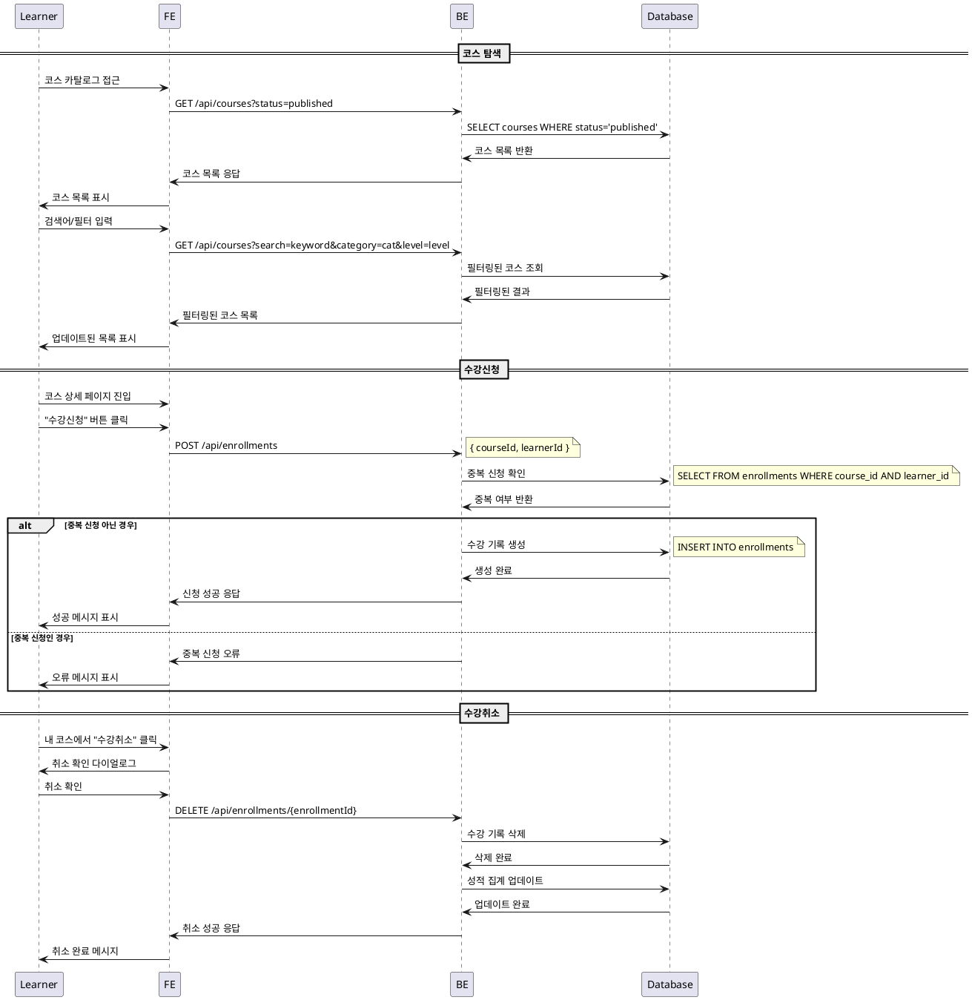

# UC-002: 코스 탐색 & 수강신청/취소 (Learner)

## Primary Actor
- Learner (학습자)

## Precondition
- 사용자가 Learner 역할로 로그인된 상태
- 코스 카탈로그 페이지에 접근 가능

## Trigger
- Learner가 코스 카탈로그 페이지에 접근하여 코스를 탐색하거나 수강신청/취소를 시도

## Main Scenario

### 코스 탐색
1. Learner가 코스 카탈로그 페이지 접근
2. 시스템이 게시된 코스 목록 표시 (status = 'published')
3. Learner가 검색어 입력 또는 필터 적용 (카테고리, 난이도)
4. Learner가 정렬 옵션 선택 (최신순/인기순)
5. 시스템이 필터링된 코스 목록 표시
6. Learner가 관심 코스 상세 페이지 진입

### 수강신청
7. Learner가 코스 상세 페이지에서 "수강신청" 버튼 클릭
8. 시스템이 수강 가능 여부 검증 (중복 신청 확인)
9. 시스템이 enrollments 테이블에 수강 기록 생성
10. 시스템이 성공 메시지 표시
11. Learner 대시보드에 해당 코스 추가

### 수강취소
12. Learner가 내 코스 목록에서 "수강취소" 버튼 클릭
13. 시스템이 취소 확인 다이얼로그 표시
14. Learner가 취소 확인
15. 시스템이 enrollments 테이블에서 수강 기록 삭제
16. 시스템이 관련 성적 데이터 집계에서 제외
17. Learner 대시보드에서 해당 코스 제거

## Edge Cases

- **중복 수강신청**: 이미 신청한 코스 재신청 시도 시 오류 메시지
- **비공개 코스 신청**: draft/archived 상태 코스 신청 시도 시 차단
- **수강 정원 초과**: 정원이 있는 경우 초과 시 대기열 또는 신청 불가 안내
- **네트워크 오류**: 신청/취소 중 연결 실패 시 재시도 안내
- **권한 오류**: 로그인 만료 시 재로그인 요구
- **진행 중인 과제**: 수강취소 시 진행 중인 과제가 있으면 경고 메시지

## Business Rules

- 수강신청은 'published' 상태의 코스만 가능
- 동일 코스 중복 신청 불가
- 수강취소는 언제든 가능
- 수강취소 시 해당 코스의 모든 성적 데이터는 집계에서 제외
- 수강취소 시 제출한 과제는 삭제되지 않지만 성적에 반영되지 않음
- 검색은 코스 제목, 설명, 강사명을 대상으로 함
- 필터링은 AND 조건으로 적용

## Sequence Diagram

