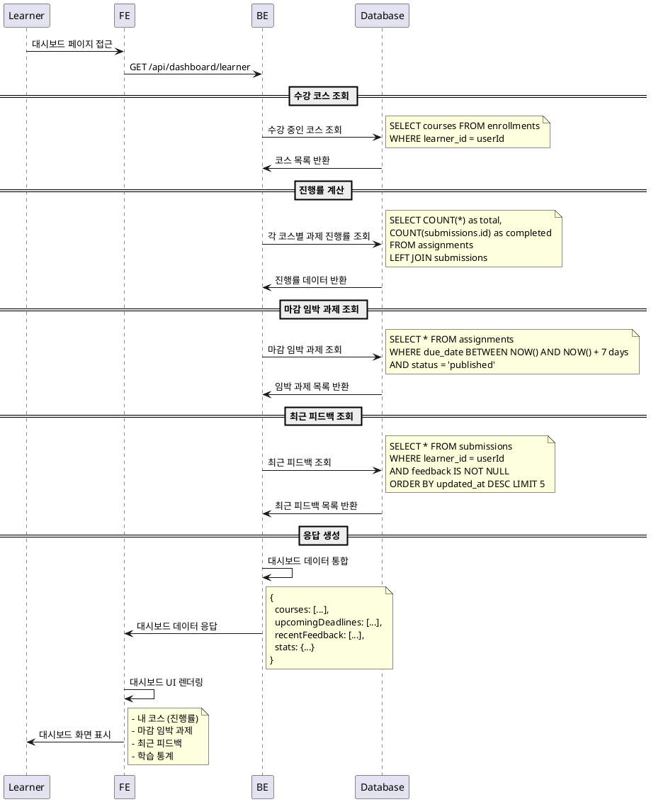

# UC-003: Learner 대시보드

## Primary Actor
- Learner (학습자)

## Precondition
- 사용자가 Learner 역할로 로그인된 상태
- 하나 이상의 코스에 수강신청된 상태 (선택사항)

## Trigger
- Learner가 대시보드 페이지에 접근

## Main Scenario

1. Learner가 대시보드 페이지 접근
2. 시스템이 사용자의 수강 중인 코스 목록 조회
3. 시스템이 각 코스별 진행률 계산
   - 완료한 과제 수 / 전체 과제 수 × 100
4. 시스템이 마감 임박 과제 목록 조회 (7일 이내 마감)
5. 시스템이 최근 받은 피드백 조회 (최근 5개)
6. 시스템이 대시보드 정보를 통합하여 표시
   - 내 코스 목록 (진행률 포함)
   - 마감 임박 과제 알림
   - 최근 피드백 요약
   - 전체 학습 통계

## Edge Cases

- **수강 코스 없음**: 수강 중인 코스가 없을 때 코스 탐색 안내 메시지
- **과제 없음**: 진행 중인 과제가 없을 때 "과제 없음" 표시
- **피드백 없음**: 받은 피드백이 없을 때 "피드백 없음" 표시
- **로딩 실패**: 데이터 로딩 중 오류 발생 시 재시도 버튼 제공
- **권한 만료**: 세션 만료 시 로그인 페이지로 리다이렉트
- **네트워크 오류**: 연결 실패 시 오프라인 모드 안내

## Business Rules

- 진행률은 제출 완료된 과제 기준으로 계산
- 마감 임박 과제는 7일 이내 마감 예정인 과제만 표시
- 최근 피드백은 최대 5개까지만 표시
- 코스 목록은 수강신청 날짜 순으로 정렬
- 과제 상태별 색상 구분 (미제출/제출완료/채점완료/재제출요청)
- 실시간 업데이트는 페이지 새로고침 시에만 반영
- 개인정보는 본인 것만 조회 가능

## Sequence Diagram

