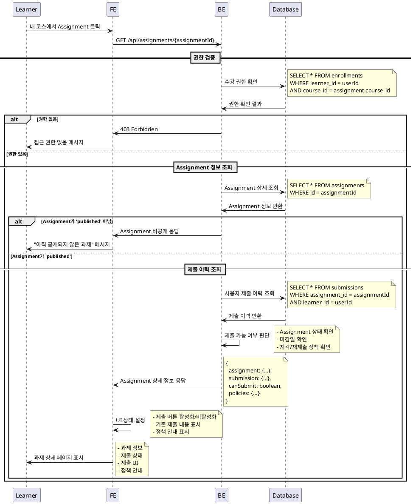

# UC-004: 과제 상세 열람 (Learner)

## Primary Actor
- Learner (학습자)

## Precondition
- 사용자가 Learner 역할로 로그인된 상태
- 해당 코스에 수강신청된 상태
- 과제가 'published' 상태

## Trigger
- Learner가 내 코스 목록에서 특정 과제를 선택하여 상세 페이지 진입

## Main Scenario

1. Learner가 내 코스 목록에서 Assignment 목록 확인
2. Learner가 특정 Assignment 클릭
3. 시스템이 사용자의 수강 권한 검증
4. 시스템이 Assignment 상태 확인 ('published' 여부)
5. 시스템이 Assignment 상세 정보 조회
6. 시스템이 사용자의 제출 이력 조회
7. 시스템이 과제 상세 페이지 표시
   - 과제 제목 및 설명
   - 마감일 및 남은 시간
   - 점수 비중
   - 제출 정책 (지각 허용/재제출 허용 여부)
   - 제출 상태 및 이력
   - 제출 UI (상태에 따라 활성화/비활성화)

## Edge Cases

- **권한 없음**: 수강하지 않은 코스의 과제 접근 시 접근 거부
- **비공개 과제**: 'draft' 상태 과제 접근 시 "아직 공개되지 않은 과제" 메시지
- **마감된 과제**: 'closed' 상태 과제는 열람 가능하지만 제출 버튼 비활성화
- **삭제된 과제**: 존재하지 않는 과제 ID 접근 시 404 오류
- **로딩 실패**: 과제 정보 로딩 실패 시 재시도 버튼 제공
- **세션 만료**: 로그인 세션 만료 시 로그인 페이지로 리다이렉트

## Business Rules

- 'published' 상태의 과제만 열람 가능
- 수강 중인 코스의 과제만 접근 가능
- 'closed' 상태 과제는 제출 불가, 열람만 가능
- 마감일이 지난 과제도 지각 허용 정책에 따라 제출 가능 여부 결정
- 재제출 허용 정책에 따라 이미 제출한 과제의 재제출 가능 여부 결정
- 제출 이력이 있는 경우 기존 제출 내용 표시
- 점수와 피드백이 있는 경우 함께 표시

## Sequence Diagram

