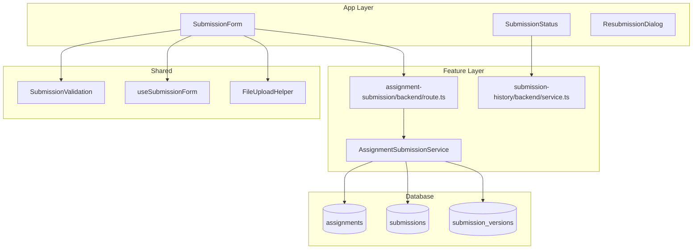

# UC-005: 과제 제출/재제출 - 구현 계획

## 개요

### Feature Modules
- **Assignment Submission Feature** (`src/features/assignment-submission/`)
  - Learner 제출/재제출 API와 폼 컴포넌트, 상태 훅을 포함
- **Submission History Feature** (`src/features/submission-history/`)
  - (UC-004와 공유) 제출 이력 조회 API를 재사용해 업데이트된 데이터를 반영

### Shared Modules
- **Submission Validation Utils** (`src/lib/submission-validation.ts`)
  - 텍스트/URL 검증, 길이 제한, 금칙어 검사 등 공통 로직 제공
- **Submission Form Hook** (`src/features/assignment-submission/hooks/useSubmissionForm.ts`)
  - React Hook Form 기반 입력 상태 및 API mutation 관리
- **File Upload Helper (Optional)** (`src/lib/file-upload.ts`)
  - 향후 첨부 파일 지원을 위한 프록시 레이어 (현재는 비활성화 플래그)

## Diagram

## Implementation Plan

### 1. Database Schema Updates
**파일**: `supabase/migrations/0007_submission_extensions.sql`
- `submissions` 테이블에 `word_count`, `attachment_url`(nullable), `resubmission_count` 컬럼 추가
- `submission_versions` 테이블 신설: `id`, `submission_id`, `content_snapshot`, `link_snapshot`, `captured_at`로 재제출 이력 저장
- `submissions` 업데이트 시 trigger(`create_submission_version`)로 기존 데이터를 `submission_versions`에 보존
- 인덱스: `submission_versions_submission_idx`

### 2. Backend Implementation

#### Submission Schema
**파일**: `src/features/assignment-submission/backend/schema.ts`
- `SubmissionRequestSchema`: `assignmentId`, `content`, `linkUrl`, `attachmentUrl?`
- `SubmissionResponseSchema`: `submission`, `isLate`, `wasResubmitted`

#### Assignment Submission Service
**파일**: `src/features/assignment-submission/backend/service.ts`
- `submit(learnerId, payload)`
  1. 과제/정책/마감 상태 조회 (`assignment-detail` 접근 가드 활용)
  2. 기존 제출 존재 여부 확인 → 신규/재제출 경로 분기
  3. 정책 검사 (`evaluateSubmissionWindow` 호출)
  4. 신규: `insert` + `resubmission_count=0`
  5. 재제출: `update` + `resubmission_count += 1` + trigger로 버전 보존
  6. 결과를 `SubmissionResponseSchema`로 반환

**Unit Tests** (`__tests__/service.test.ts`):
- `creates first submission before deadline`
- `marks submission late when allowed`
- `rejects submission when late not allowed`
- `updates existing submission when resubmission allowed`
- `rejects resubmission when assignment disallows`
- `captures previous version on resubmission`

#### Submission Controller (Route)
**파일**: `src/features/assignment-submission/backend/route.ts`
- `POST /api/submissions` → 신규/재제출 처리
- `PATCH /api/submissions/:id` → 향후 확장 대비, 현재는 동일 로직 재사용
- `DELETE` 미구현 (Instructor 리뷰에서 제어)
- `withRoleGuard('learner')` 적용, body는 `SubmissionRequestSchema`로 파싱

#### Submission History Service (재사용)
- 재제출 후 최신 상태 제공을 위해 `getSubmissionHistory` 호출, 응답에서 새 데이터 반환

### 3. Frontend Implementation

#### Submission Form Component
**파일**: `src/features/assignment-submission/components/SubmissionForm.tsx`
- React Hook Form + zodResolver → 입력 검증, `useSubmissionForm` 훅 사용
- 재제출 시 초기값에 기존 제출 내용 세팅

**QA Sheet**:
- [ ] 필수 텍스트 미입력 시 즉시 에러가 표시되는가?
- [ ] 텍스트 최소 10자, 최대 10,000자 제한이 동작하는가?
- [ ] 링크 입력 시 URL 포맷 검증이 동작하는가?
- [ ] 제출 진행 중 버튼이 로딩 상태로 잠기는가?
- [ ] 제출 성공 시 상태 카드가 즉시 업데이트되는가?
- [ ] 지각 제출 시 경고 메시지가 강조 표시되는가?
- [ ] 네트워크 오류 시 재시도 버튼이 노출되는가?

#### Submission Status Component
**파일**: `src/features/assignment-submission/components/SubmissionStatus.tsx`
- 현재 제출 상태, 점수, 피드백, 지각 여부 표시

**QA Sheet**:
- [ ] `status` 값에 따라 배지/메시지가 다르게 출력되는가?
- [ ] 지각 제출이면 `late` 배지가 표시되는가?
- [ ] 재제출 가능 조건일 때 CTA가 활성화되는가?

#### useSubmissionForm Hook
**파일**: `src/features/assignment-submission/hooks/useSubmissionForm.ts`
- `mutation` 성공 시 Dashboard/AssignmentDetail 쿼리 무효화 (`queryClient.invalidateQueries`)
- 제출 성공 토스트, 실패 시 에러 토스트 호출

### 4. Shared Utilities
- `src/lib/submission-validation.ts`: `SubmissionSchema`, `validateWordCount(content)`, `normalizeLink(url)`
- `src/lib/file-upload.ts`: 현재는 미사용이나 API 형태 정의 (`uploadAttachment(file): Promise<url>`)
- `src/lib/analytics.ts`: `track('assignment_submitted', { assignmentId, isLate })`

### 5. Integration & Observability
- Submission 성공 시 Learner 대시보드(`['dashboard','learner']`)와 Assignment Detail(`['assignments', assignmentId]`) 캐시 무효화
- Instructor 채점 큐(UC-006) 연동을 위한 이벤트 큐 메시지 발행 (추후 구현, TODO 주석)
- 실패 로깅: `logger.error('submission_failed', { assignmentId, userId, code })`
- Supabase Row-Level Security 정책 업데이트 (Learner 본인 제출만 insert/update 허용)

### 6. Testing Strategy
- **Unit**: 서비스, validation 유틸, hook 로직 (mutation success/error)을 Vitest로 검증
- **Integration**: `tests/api/submissions.test.ts` – 신규 제출, 지각 제출, 재제출, 정책 위반
- **E2E**: Playwright `assignment-submission.spec.ts` – 폼 입력 → 제출 → 상태 업데이트 흐름 테스트
- **Regression**: 재제출 시 trigger로 버전이 생성되는지 Supabase SQL 검사 포함
