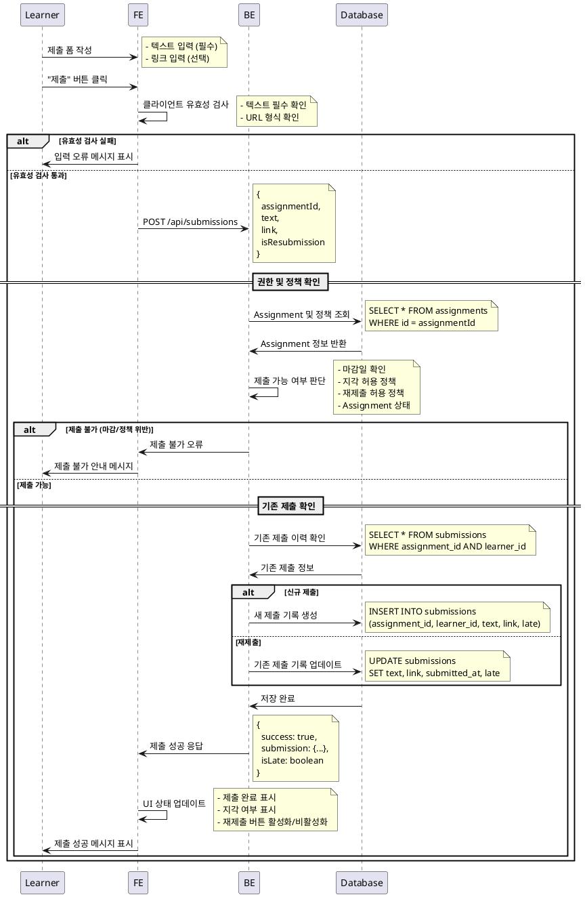

# UC-005: 과제 제출/재제출 (Learner)

## Primary Actor
- Learner (학습자)

## Precondition
- 사용자가 Learner 역할로 로그인된 상태
- 해당 코스에 수강신청된 상태
- 과제가 'published' 상태이고 제출 가능한 상태
- 과제 상세 페이지에 접근한 상태

## Trigger
- Learner가 과제 상세 페이지에서 제출 폼을 작성하고 "제출" 버튼 클릭

## Main Scenario

### 신규 제출
1. Learner가 과제 상세 페이지에서 제출 폼 확인
2. Learner가 텍스트 필드에 과제 내용 입력 (필수)
3. Learner가 링크 필드에 참고 URL 입력 (선택)
4. Learner가 "제출" 버튼 클릭
5. 시스템이 입력값 유효성 검사 수행
6. 시스템이 마감일 및 정책 확인
7. 시스템이 제출 기록을 submissions 테이블에 저장
8. 시스템이 제출 성공 메시지 표시
9. 과제 상태가 "제출 완료"로 업데이트

### 재제출
10. 기존 제출물이 있는 상태에서 재제출 허용 정책 확인
11. Learner가 기존 내용을 수정하고 "재제출" 버튼 클릭
12. 시스템이 재제출 허용 여부 및 마감일 확인
13. 시스템이 기존 제출 기록 업데이트
14. 시스템이 재제출 성공 메시지 표시

## Edge Cases

- **마감일 초과 (지각 허용)**: 마감일 후 제출 시 `late=true`로 기록하고 지각 표시
- **마감일 초과 (지각 불허)**: 마감일 후 제출 시도 시 제출 차단 및 안내 메시지
- **재제출 불허**: 재제출 허용하지 않는 과제에서 재제출 시도 시 차단
- **텍스트 누락**: 필수 텍스트 필드 미입력 시 폼 검증 오류
- **잘못된 URL**: 링크 필드에 올바르지 않은 URL 형식 입력 시 검증 오류
- **과제 마감**: 제출 중 과제가 'closed' 상태로 변경 시 제출 실패
- **네트워크 오류**: 제출 중 연결 실패 시 재시도 안내
- **서버 오류**: 데이터베이스 저장 실패 시 오류 메시지

## Business Rules

- 텍스트 필드는 필수 입력 (최소 10자 이상)
- 링크 필드는 선택 입력 (입력 시 유효한 URL 형식이어야 함)
- 마감일 전 제출: `status=submitted`, `late=false`
- 마감일 후 제출 (지각 허용): `status=submitted`, `late=true`
- 마감일 후 제출 (지각 불허): 제출 차단
- 재제출 시 기존 데이터 덮어쓰기 (이력 관리는 별도 테이블)
- 제출 후 수정은 재제출 정책에 따라 결정
- 'closed' 상태 과제는 제출 불가
- 채점 완료 후 재제출은 강사 승인 필요

## Sequence Diagram

