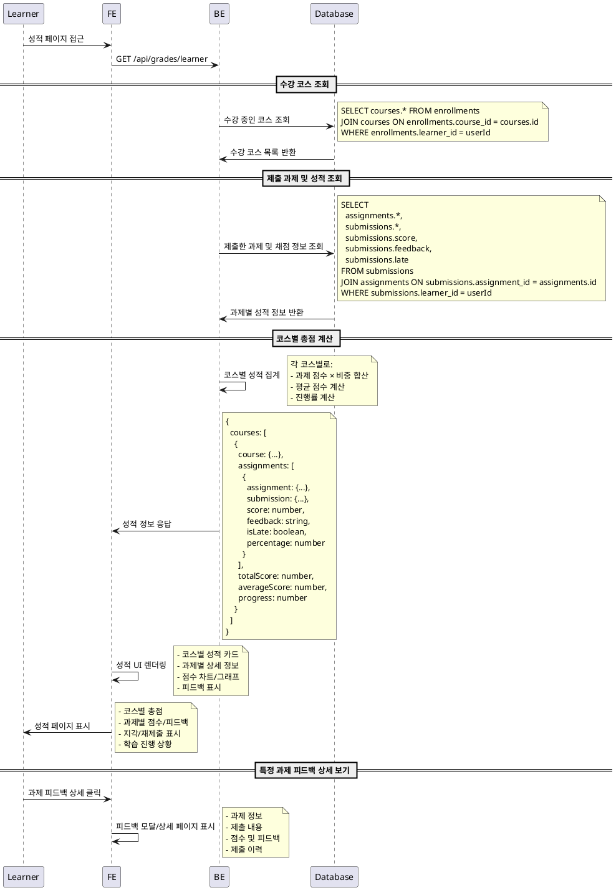

# UC-006: 성적 & 피드백 열람 (Learner)

## Primary Actor
- Learner (학습자)

## Precondition
- 사용자가 Learner 역할로 로그인된 상태
- 하나 이상의 코스에 수강신청된 상태
- 제출한 과제가 있는 상태 (선택사항)

## Trigger
- Learner가 성적 페이지 또는 특정 코스의 성적 탭에 접근

## Main Scenario

1. Learner가 성적 페이지 접근
2. 시스템이 사용자의 수강 중인 코스 목록 조회
3. 시스템이 각 코스별 제출한 과제 목록 조회
4. 시스템이 과제별 채점 정보 조회 (점수, 피드백, 상태)
5. 시스템이 코스별 총점 계산 (과제 점수 × 비중의 합)
6. 시스템이 성적 정보를 정리하여 표시
   - 코스별 성적 요약
   - 과제별 상세 점수 및 피드백
   - 지각/재제출 여부 표시
   - 전체 학습 진행 상황

## Edge Cases

- **제출 과제 없음**: 제출한 과제가 없을 때 "제출한 과제가 없습니다" 메시지
- **미채점 과제**: 아직 채점되지 않은 과제는 "채점 대기 중" 표시
- **피드백 없음**: 점수만 있고 피드백이 없는 경우 "피드백 없음" 표시
- **수강 코스 없음**: 수강 중인 코스가 없을 때 코스 탐색 안내
- **권한 오류**: 다른 사용자의 성적 접근 시도 시 접근 거부
- **로딩 실패**: 성적 정보 로딩 실패 시 재시도 버튼 제공
- **세션 만료**: 로그인 세션 만료 시 로그인 페이지로 리다이렉트

## Business Rules

- 본인이 제출한 과제의 성적만 조회 가능
- 채점 완료된 과제만 점수 표시
- 코스별 총점은 (과제 점수 × 과제 비중)의 합으로 계산
- 지각 제출 과제는 별도 표시 (late 플래그)
- 재제출한 과제는 최종 제출 기준으로 점수 계산
- 피드백은 HTML 형태로 표시 (안전한 태그만 허용)
- 성적은 실시간 반영 (채점 완료 즉시 표시)
- 과제별 만점 대비 백분율도 함께 표시

## Sequence Diagram

