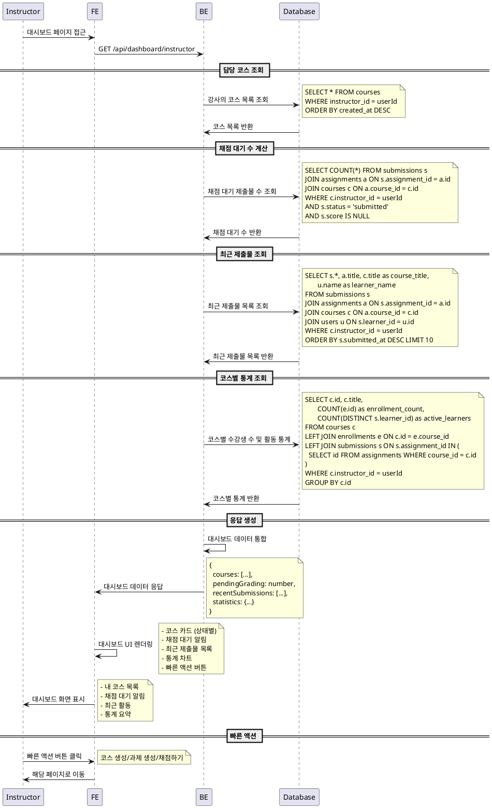

# UC-007: Instructor 대시보드

## Primary Actor
- Instructor (강사)

## Precondition
- 사용자가 Instructor 역할로 로그인된 상태
- 하나 이상의 코스를 생성했거나 담당하고 있는 상태 (선택사항)

## Trigger
- Instructor가 대시보드 페이지에 접근

## Main Scenario

1. Instructor가 대시보드 페이지 접근
2. 시스템이 강사가 담당하는 코스 목록 조회
3. 시스템이 각 코스별 상태 정보 조회 (draft/published/archived)
4. 시스템이 채점 대기 중인 제출물 수 계산
5. 시스템이 최근 제출된 과제 목록 조회 (최근 10개)
6. 시스템이 코스별 수강생 수 및 활동 통계 조회
7. 시스템이 대시보드 정보를 통합하여 표시
   - 내 코스 목록 (상태별 구분)
   - 채점 대기 알림
   - 최근 제출물 목록
   - 코스별 통계 요약

## Edge Cases

- **담당 코스 없음**: 생성한 코스가 없을 때 "코스 생성하기" 안내 버튼
- **채점 대기 없음**: 채점할 제출물이 없을 때 "채점할 과제가 없습니다" 표시
- **최근 제출물 없음**: 최근 제출물이 없을 때 "최근 제출물이 없습니다" 표시
- **권한 오류**: 다른 강사의 대시보드 접근 시도 시 접근 거부
- **로딩 실패**: 대시보드 정보 로딩 실패 시 재시도 버튼 제공
- **세션 만료**: 로그인 세션 만료 시 로그인 페이지로 리다이렉트
- **서버 과부하**: 통계 계산 중 타임아웃 시 기본값 표시

## Business Rules

- 본인이 생성한 코스만 조회 가능
- 채점 대기는 'submitted' 상태이면서 점수가 없는 제출물 기준
- 최근 제출물은 제출일 기준 최신 10개까지 표시
- 코스 상태별 색상 구분 (draft: 회색, published: 초록, archived: 주황)
- 수강생 수는 활성 등록(enrollment) 기준으로 계산
- 통계는 실시간이 아닌 캐시된 데이터 사용 (성능 최적화)
- 빠른 액션 버튼 제공 (코스 생성, 과제 생성, 채점하기)

## Sequence Diagram

