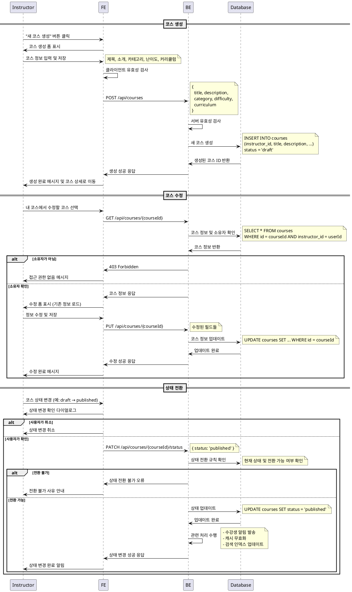

# UC-008: 코스 관리 (Instructor)

## Primary Actor
- Instructor (강사)

## Precondition
- 사용자가 Instructor 역할로 로그인된 상태
- 코스 관리 권한을 보유한 상태

## Trigger
- Instructor가 코스 생성 또는 기존 코스 수정을 위해 코스 관리 페이지에 접근

## Main Scenario

### 코스 생성
1. Instructor가 "새 코스 생성" 버튼 클릭
2. 시스템이 코스 생성 폼 표시
3. Instructor가 코스 정보 입력
   - 제목, 소개, 카테고리, 난이도, 커리큘럼
4. Instructor가 "저장" 버튼 클릭
5. 시스템이 입력값 유효성 검사 수행
6. 시스템이 새 코스를 'draft' 상태로 생성
7. 시스템이 생성 완료 메시지 표시

### 코스 수정
8. Instructor가 내 코스 목록에서 수정할 코스 선택
9. 시스템이 소유자 권한 확인
10. 시스템이 코스 수정 폼 표시 (기존 정보 로드)
11. Instructor가 정보 수정
12. Instructor가 "수정 완료" 버튼 클릭
13. 시스템이 변경사항 저장
14. 시스템이 수정 완료 메시지 표시

### 상태 전환
15. Instructor가 코스 상태 변경 (draft/published/archived)
16. 시스템이 상태 전환 규칙 확인
17. 시스템이 상태 업데이트 및 관련 처리 수행
18. 시스템이 상태 변경 완료 알림

## Edge Cases

- **권한 없음**: 다른 강사의 코스 수정 시도 시 접근 거부
- **필수 정보 누락**: 제목, 소개 등 필수 필드 미입력 시 폼 검증 오류
- **중복 제목**: 동일한 제목의 코스 생성 시도 시 경고 (허용하되 안내)
- **수강생 있는 상태에서 archived**: 수강생이 있는 코스 보관 시 확인 다이얼로그
- **published 상태에서 주요 정보 변경**: 공개된 코스의 핵심 정보 변경 시 경고
- **네트워크 오류**: 저장 중 연결 실패 시 임시 저장 및 재시도 안내
- **서버 오류**: 데이터베이스 저장 실패 시 오류 메시지 및 복구 안내

## Business Rules

- 코스 소유자만 수정 가능
- 'draft' 상태: 강사만 볼 수 있음, 수강신청 불가
- 'published' 상태: 공개되어 수강신청 가능
- 'archived' 상태: 신규 수강신청 차단, 기존 수강생은 접근 가능
- 제목은 최대 100자, 소개는 최대 1000자
- 카테고리와 난이도는 사전 정의된 값만 선택 가능
- 커리큘럼은 마크다운 형식으로 작성
- 상태 전환 시 수강생에게 알림 발송 (published → archived)
- 삭제는 draft 상태이고 수강생이 없는 경우만 가능

## Sequence Diagram

