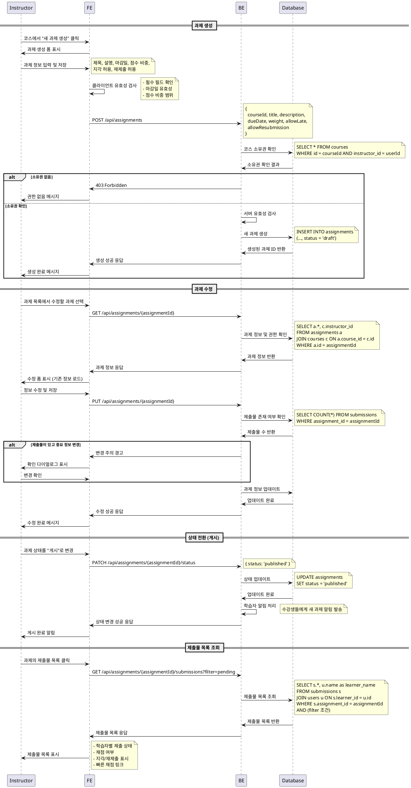

# UC-009: 과제 관리 (Instructor)

## Primary Actor
- Instructor (강사)

## Precondition
- 사용자가 Instructor 역할로 로그인된 상태
- 하나 이상의 코스를 소유하고 있는 상태
- 코스 관리 권한을 보유한 상태

## Trigger
- Instructor가 특정 코스의 과제 관리 페이지에 접근하거나 새 과제를 생성하려고 시도

## Main Scenario

### 과제 생성
1. Instructor가 코스 상세 페이지에서 "새 과제 생성" 버튼 클릭
2. 시스템이 과제 생성 폼 표시
3. Instructor가 과제 정보 입력
   - 제목, 설명, 마감일, 점수 비중
   - 지각 허용 여부, 재제출 허용 여부
4. Instructor가 "저장" 버튼 클릭
5. 시스템이 입력값 유효성 검사 수행
6. 시스템이 새 과제를 'draft' 상태로 생성
7. 시스템이 생성 완료 메시지 표시

### 과제 수정
8. Instructor가 과제 목록에서 수정할 과제 선택
9. 시스템이 소유 코스 권한 확인
10. 시스템이 과제 수정 폼 표시 (기존 정보 로드)
11. Instructor가 정보 수정
12. Instructor가 "수정 완료" 버튼 클릭
13. 시스템이 변경사항 저장
14. 시스템이 수정 완료 메시지 표시

### 상태 전환
15. Instructor가 과제 상태 변경 (draft/published/closed)
16. 시스템이 상태 전환 규칙 확인
17. 시스템이 상태 업데이트 및 관련 처리 수행
18. 학습자 화면에 변경사항 반영

### 제출물 관리
19. Instructor가 과제의 제출물 목록 조회
20. 시스템이 필터 옵션 제공 (미채점/지각/재제출요청)
21. Instructor가 필터 적용하여 제출물 확인

## Edge Cases

- **권한 없음**: 다른 강사의 코스 과제 관리 시도 시 접근 거부
- **필수 정보 누락**: 제목, 마감일 등 필수 필드 미입력 시 폼 검증 오류
- **과거 마감일**: 현재 시간보다 이전 마감일 설정 시 경고 메시지
- **제출물 있는 상태에서 수정**: 이미 제출물이 있는 과제 수정 시 주의 안내
- **published → closed 자동 전환**: 마감일 도달 시 자동으로 closed 상태로 변경
- **네트워크 오류**: 저장 중 연결 실패 시 임시 저장 및 재시도 안내
- **동시 수정**: 여러 강사가 동시 수정 시도 시 충돌 방지

## Business Rules

- 소유한 코스의 과제만 관리 가능
- 'draft' 상태: 학습자에게 노출되지 않음
- 'published' 상태: 학습자가 제출 가능
- 'closed' 상태: 제출 불가, 채점만 가능
- 마감일 이후 자동으로 'closed' 상태로 전환
- 점수 비중은 0-100 범위 내에서 설정
- 제목은 최대 200자, 설명은 최대 2000자
- 지각/재제출 정책은 과제별로 개별 설정
- 제출물이 있는 과제는 삭제 불가 (archived 처리)
- 마감일 변경 시 수강생에게 알림 발송

## Sequence Diagram

