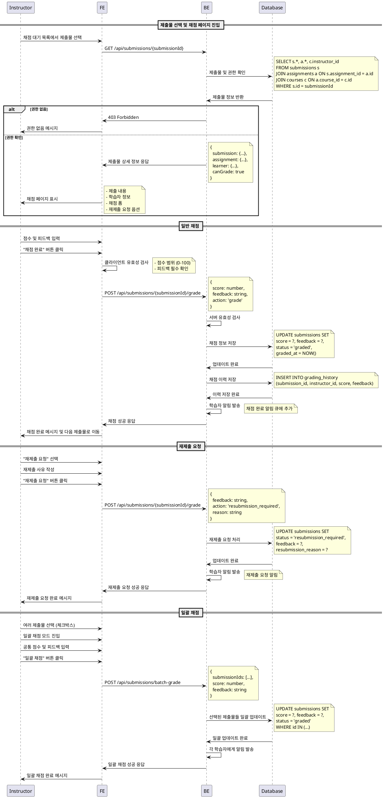

# UC-010: 제출물 채점 & 피드백 (Instructor)

## Primary Actor
- Instructor (강사)

## Precondition
- 사용자가 Instructor 역할로 로그인된 상태
- 채점할 제출물이 존재하는 상태 (status = 'submitted')
- 해당 과제의 소유 코스에 대한 권한 보유

## Trigger
- Instructor가 제출물 목록에서 특정 제출물을 선택하여 채점 페이지에 접근

## Main Scenario

### 제출물 채점
1. Instructor가 채점 대기 목록에서 제출물 선택
2. 시스템이 제출물 상세 정보 표시
   - 학습자 정보, 제출 내용, 제출일, 지각 여부
3. Instructor가 제출 내용 검토
4. Instructor가 점수 입력 (0-100 범위)
5. Instructor가 피드백 작성
6. Instructor가 "채점 완료" 버튼 클릭
7. 시스템이 입력값 유효성 검사 수행
8. 시스템이 채점 정보를 저장하고 상태를 'graded'로 변경
9. 시스템이 학습자에게 채점 완료 알림 발송
10. 학습자 대시보드 및 성적 페이지에 결과 반영

### 재제출 요청
11. Instructor가 제출물 검토 후 "재제출 요청" 선택
12. Instructor가 재제출 사유 작성
13. Instructor가 "재제출 요청" 버튼 클릭
14. 시스템이 상태를 'resubmission_required'로 변경
15. 시스템이 학습자에게 재제출 요청 알림 발송
16. 학습자가 과제를 다시 제출할 수 있도록 UI 활성화

### 일괄 채점
17. Instructor가 여러 제출물 선택
18. Instructor가 일괄 점수 및 공통 피드백 입력
19. 시스템이 선택된 모든 제출물에 동일한 채점 적용

## Edge Cases

- **권한 없음**: 다른 강사의 코스 제출물 채점 시도 시 접근 거부
- **점수 범위 초과**: 0-100 범위를 벗어난 점수 입력 시 검증 오류
- **피드백 누락**: 피드백 없이 채점 시도 시 필수 입력 안내
- **이미 채점된 제출물**: 재채점 시도 시 확인 다이얼로그
- **제출물 삭제**: 채점 중 제출물이 삭제된 경우 오류 처리
- **동시 채점**: 여러 강사가 동시 채점 시도 시 충돌 방지
- **네트워크 오류**: 채점 저장 중 연결 실패 시 임시 저장 및 재시도
- **대용량 피드백**: 피드백 내용이 너무 긴 경우 길이 제한 안내

## Business Rules

- 점수는 0-100 범위 내에서만 입력 가능
- 피드백은 필수 입력 (최소 10자 이상)
- 채점 완료 시 상태가 'graded'로 변경
- 재제출 요청 시 상태가 'resubmission_required'로 변경
- 재제출된 과제는 최신 제출 기준으로 채점
- 지각 제출 과제도 동일한 기준으로 채점
- 채점 이력은 별도 테이블에 보관 (감사 목적)
- 피드백은 마크다운 형식 지원
- 일괄 채점은 동일한 과제의 제출물만 가능
- 채점 후 수정은 특별한 사유가 있을 때만 허용

## Sequence Diagram

