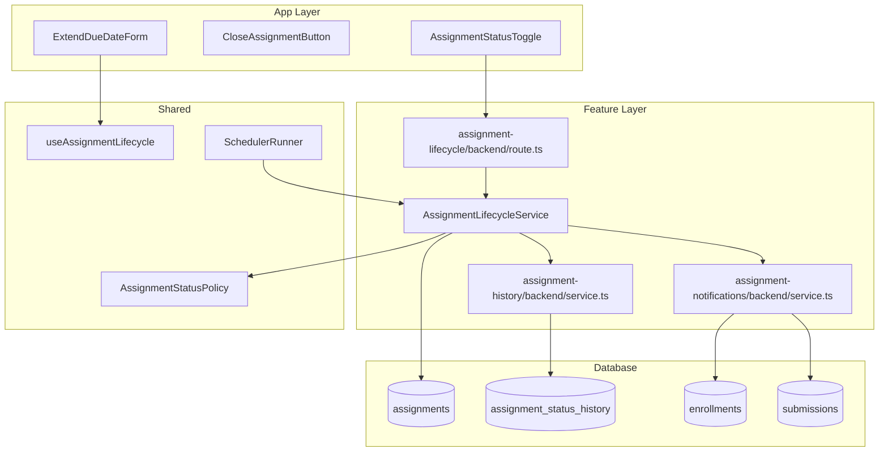

# UC-011: Assignment 게시/마감 - 구현 계획

## 개요

### Feature Modules
- **Assignment Lifecycle Feature** (`src/features/assignment-lifecycle/`)
  - 게시/마감/재개 API와 스케줄러 연동을 담당
- **Assignment Notification Feature** (`src/features/assignment-notifications/`)
  - 상태 변화 시 학습자 알림 발송 로직을 분리해 재사용
- **Lifecycle History Feature** (`src/features/assignment-history/`)
  - 상태 변경 이력 저장 및 조회

### Shared Modules
- **Assignment Status Policy** (`src/lib/assignment-status-policy.ts`)
  - 상태 전환 허용 매트릭스, 마감일 검증, 연장 정책 제공
- **useAssignmentLifecycle Hook** (`src/features/assignment-lifecycle/hooks/useAssignmentLifecycle.ts`)
  - Instructor UI에서 게시/마감/연장 CTA를 제어
- **Scheduler Runner** (`src/backend/scheduler/assignmentCron.ts`)
  - Supabase cron 함수 호출 또는 Vercel CRON을 통한 자동 마감 처리

## Diagram

## Implementation Plan

### 1. Database Schema Updates
**파일**: `supabase/migrations/0013_assignment_lifecycle.sql`
- `assignments` 테이블에 `published_at`, `closed_at`, `manual_closed` BOOLEAN, `last_status_change_by` UUID 추가
- `assignment_status_history` 테이블 생성: `id`, `assignment_id`, `previous_status`, `next_status`, `changed_by`, `reason`, `metadata`, `created_at`
- 뷰 `assignments_due_soon` 생성: 24시간 이내 마감 예정 과제 (자동 알림 대비)
- 인덱스: `assignment_status_history_assignment_idx`

### 2. Backend Implementation

#### Lifecycle Schema
**파일**: `src/features/assignment-lifecycle/backend/schema.ts`
- `PublishAssignmentSchema`, `CloseAssignmentSchema`, `ExtendDueDateSchema`
- 응답 스키마: `AssignmentLifecycleResponseSchema` (상태, 타임스탬프, 메시지)

#### Assignment Lifecycle Service
**파일**: `src/features/assignment-lifecycle/backend/service.ts`
- `publish(assignmentId, instructorId)` → ownership 확인 → `AssignmentStatusPolicy.validate('draft','published')` → 상태 변경 → history 기록 → 알림 발송
- `close(assignmentId, instructorId, reason?, manual=true)` → 상태 변경/알림/히스토리 → 제출 비활성화 처리
- `extendDueDate(assignmentId, instructorId, newDueDate)` → 정책 검사(24시간 전 제한) → due date 업데이트 → 필요 시 상태 재개(published)
- `autoclose()` → cron runner에서 호출, `close(..., manual=false)`

**Unit Tests** (`__tests__/service.test.ts`):
- `publishes draft when required fields set`
- `rejects publish when due date in past`
- `closes assignment and records history`
- `extends due date and reopens closed assignment`
- `autoclose only affects published with due_date <= now`

#### Assignment Notifications Service
**파일**: `src/features/assignment-notifications/backend/service.ts`
- `notifyPublish(assignmentId)` → 수강생 전체 알림
- `notifyClose(assignmentId, recipients)` → 미제출자 대상으로 알림
- `notifyDueDateExtended(assignmentId, diff)` → 연장 내용 포함
- Supabase Edge function 또는 외부 이메일 서비스 연동 (stub + TODO)

**Unit Tests**:
- `builds notification payload for publish`
- `filters recipients for close notification`

#### Assignment History Service
**파일**: `src/features/assignment-history/backend/service.ts`
- 상태 이력 조회 API (`GET /api/assignments/:id/history`)
- Instructor/Learner 모두 참고 가능 (역할별 필드 제한)

#### Route Registrar
**파일**: `src/features/assignment-lifecycle/backend/route.ts`
- `PATCH /api/assignments/:assignmentId/publish`
- `PATCH /api/assignments/:assignmentId/close`
- `PATCH /api/assignments/:assignmentId/extend`
- `GET /api/assignments/:assignmentId/history`
- 모든 라우트 `withRoleGuard('instructor')`, history 조회는 Learner 허용(본인 코스)

#### Scheduler Runner
**파일**: `src/backend/scheduler/assignmentCron.ts`
- `runAssignmentAutoclose()` → `assignment-lifecycle` 서비스 `autoclose` 호출
- Vercel/CRON job 설정 문서화 (`README` 업데이트 필요)

### 3. Frontend Implementation

#### Assignment Status Controls
**파일**: `src/features/assignment-lifecycle/components/AssignmentStatusControls.tsx`
- 게시/마감/연장 CTA 버튼 + 확인 다이얼로그

**QA Sheet**:
- [ ] Draft 상태에서만 게시 버튼이 활성화되는가?
- [ ] 게시 전 필수 정보 미완성 시 경고가 표시되는가?
- [ ] 마감 버튼 클릭 시 확인 다이얼로그가 표시되는가?
- [ ] 마감일 연장 시 새 날짜가 캘린더에 반영되는가?
- [ ] 상태 변경 후 토스트와 히스토리가 업데이트되는가?

#### Assignment Timeline Component
**파일**: `src/features/assignment-history/components/AssignmentTimeline.tsx`
- 상태 변경 이력 타임라인 표시

**QA Sheet**:
- [ ] 이력 항목이 최신순으로 표시되는가?
- [ ] 상태 전환과 수행자 정보가 명확히 표시되는가?
- [ ] Learner 뷰에서는 민감 정보(reason)가 숨겨지는가?

#### useAssignmentLifecycle Hook
- 상태/권한 기반으로 버튼 활성화 여부 계산, mutation 후 캐시 무효화 처리

### 4. Shared Utilities
- `src/lib/assignment-status-policy.ts`: `canTransition(current, next)`, `validatePublishReadiness(assignment)`, `validateExtension(currentDueDate, newDueDate)`
- `src/features/assignment-lifecycle/hooks/useAssignmentLifecycle.ts`: `publish()`, `close()`, `extendDueDate()` mutation 래퍼
- `src/backend/scheduler/assignmentCron.ts`: cron에서 사용될 엔트리 포인트

### 5. Integration & Observability
- `src/backend/hono/app.ts`에 `registerAssignmentLifecycleRoutes` 추가
- 상태 변경 성공 후 캐시 무효화: `['assignments', courseId]`, `['assignments','detail',assignmentId]`, Learner 대시보드, pending queue
- 알림 서비스 실패 시 재시도 큐에 추가 (TODO: Supabase queue 연동)
- 로깅: `logger.info('assignment_status_changed', { assignmentId, previousStatus, nextStatus, manual })`
- Metrics: 게시/마감 이벤트 카운트를 Prometheus/Telemetry에 기록 (향후)

### 6. Testing Strategy
- **Unit**: 상태 정책, 서비스 로직, 알림 payload
- **Integration**: `tests/api/assignments/lifecycle.test.ts` – 게시/마감/연장/권한/자동 마감
- **E2E**: Playwright `assignment-lifecycle.spec.ts` – Instructor UI에서 상태 전환 흐름, Learner UI 반영 확인
- **Scheduler**: cron 함수 로컬 실행 테스트, 경계 케이스(마감 직전) 검증
