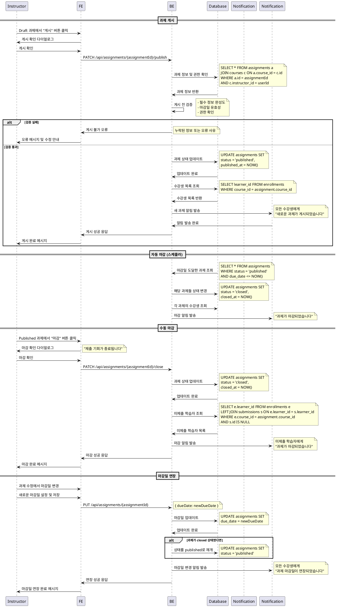

# UC-011: Assignment 게시/마감 (Instructor)

## Primary Actor
- Instructor (강사)

## Precondition
- 사용자가 Instructor 역할로 로그인된 상태
- 관리할 과제가 존재하는 상태
- 해당 과제의 소유 코스에 대한 권한 보유

## Trigger
- Instructor가 과제 상태를 변경하거나 마감 처리를 위해 과제 관리 페이지에 접근

## Main Scenario

### 과제 게시 (Draft → Published)
1. Instructor가 draft 상태의 과제 목록 확인
2. Instructor가 게시할 과제 선택
3. Instructor가 "게시" 버튼 클릭
4. 시스템이 게시 전 검증 수행 (필수 정보 완성도 확인)
5. 시스템이 과제 상태를 'published'로 변경
6. 시스템이 수강생들에게 새 과제 알림 발송
7. 학습자 화면에서 과제가 노출되기 시작
8. 시스템이 게시 완료 메시지 표시

### 과제 마감 (Published → Closed)
9. Instructor가 진행 중인 과제 목록 확인
10. Instructor가 마감할 과제 선택하거나 마감일 도달
11. 시스템이 자동 또는 수동 마감 처리
12. 시스템이 과제 상태를 'closed'로 변경
13. 시스템이 제출 기능 비활성화
14. 시스템이 수강생들에게 마감 알림 발송
15. 채점 모드로 전환 (제출만 불가, 채점은 가능)

### 마감일 연장
16. Instructor가 마감일 연장 필요 시 과제 수정
17. 시스템이 새로운 마감일 설정
18. 시스템이 수강생들에게 마감일 변경 알림 발송
19. 'closed' 상태였다면 'published'로 재개

## Edge Cases

- **필수 정보 미완성**: 게시 시도 시 제목, 설명, 마감일 등 필수 정보 누락 확인
- **과거 마감일**: 현재 시간보다 이전 마감일로 게시 시도 시 경고
- **제출물 있는 상태에서 마감일 변경**: 이미 제출한 학습자가 있을 때 신중한 변경 요구
- **자동 마감 실패**: 시스템 오류로 자동 마감이 실패한 경우 수동 처리
- **동시 상태 변경**: 여러 강사가 동시에 상태 변경 시도 시 충돌 방지
- **알림 발송 실패**: 학습자 알림 발송 실패 시 재시도 메커니즘
- **네트워크 오류**: 상태 변경 중 연결 실패 시 롤백 처리

## Business Rules

- 'draft' 상태에서만 'published'로 변경 가능
- 'published' 상태에서 'closed'로 변경 가능 (수동/자동)
- 마감일 도달 시 자동으로 'closed' 상태로 전환
- 'closed' 상태에서도 마감일 연장 시 'published'로 재개 가능
- 게시 시 모든 수강생에게 알림 발송
- 마감 시 미제출 학습자에게 마감 알림 발송
- 상태 변경 이력은 감사 목적으로 보관
- 제출물이 있는 과제는 삭제 불가
- 마감일 변경은 24시간 전까지만 허용 (정책에 따라 조정 가능)
- 긴급 상황 시 관리자 권한으로 예외 처리 가능

## Sequence Diagram

