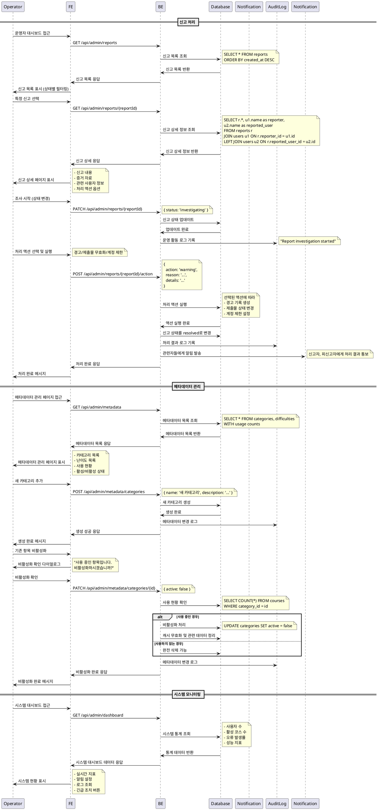

# UC-012: 운영 (Operator)

## Primary Actor
- Operator (운영자)

## Precondition
- 사용자가 Operator 역할로 로그인된 상태
- 시스템 관리 권한을 보유한 상태

## Trigger
- 신고 접수, 메타데이터 관리, 또는 시스템 운영 업무를 위해 운영자 대시보드에 접근

## Main Scenario

### 신고 처리
1. 운영자가 신고 관리 페이지 접근
2. 시스템이 접수된 신고 목록 표시 (received/investigating/resolved 상태별)
3. 운영자가 처리할 신고 선택
4. 시스템이 신고 상세 정보 표시 (신고 대상, 사유, 내용, 증거)
5. 운영자가 신고 내용 검토 및 조사
6. 운영자가 신고 상태를 'investigating'으로 변경
7. 운영자가 조사 결과에 따라 처리 액션 결정
   - 경고 발송, 제출물 무효화, 계정 제한 등
8. 운영자가 처리 결과 기록 및 상태를 'resolved'로 변경
9. 시스템이 신고자 및 피신고자에게 처리 결과 알림

### 메타데이터 관리
10. 운영자가 메타데이터 관리 페이지 접근
11. 시스템이 카테고리, 난이도 등 메타데이터 목록 표시
12. 운영자가 새 메타데이터 추가 또는 기존 항목 수정
13. 운영자가 사용 중인 메타데이터의 비활성화 처리
14. 시스템이 변경사항 저장 및 관련 캐시 무효화

### 시스템 모니터링
15. 운영자가 시스템 대시보드에서 주요 지표 확인
16. 시스템이 사용자 활동, 오류 로그, 성능 지표 표시
17. 운영자가 이상 상황 발견 시 알림 설정 또는 긴급 조치

## Edge Cases

- **권한 부족**: Operator 권한이 없는 사용자의 접근 시도 시 차단
- **중복 신고**: 동일한 대상에 대한 중복 신고 처리 시 통합 관리
- **증거 부족**: 신고 내용에 충분한 증거가 없을 때 추가 조사 요청
- **사용 중인 메타데이터 삭제**: 현재 사용 중인 카테고리/난이도 삭제 시도 시 경고
- **시스템 과부하**: 대량의 신고나 관리 작업으로 인한 성능 저하 시 우선순위 처리
- **긴급 상황**: 보안 위협이나 시스템 장애 시 즉시 대응 프로세스
- **데이터 무결성**: 메타데이터 변경 시 기존 데이터와의 일관성 확인

## Business Rules

- Operator 권한은 최고 관리자만 부여 가능
- 모든 운영 활동은 감사 로그에 기록
- 신고 처리는 접수일로부터 7일 이내 완료
- 계정 제한 조치는 단계적 적용 (경고 → 일시정지 → 영구정지)
- 메타데이터 변경 시 기존 데이터 마이그레이션 계획 필요
- 사용 중인 메타데이터는 비활성화만 가능 (삭제 불가)
- 신고 처리 결과는 투명하게 공개 (개인정보 제외)
- 긴급 상황 시 임시 조치 후 사후 승인 절차
- 시스템 변경사항은 사전 공지 및 롤백 계획 수립
- 개인정보 관련 신고는 별도의 엄격한 절차 적용

## Sequence Diagram

